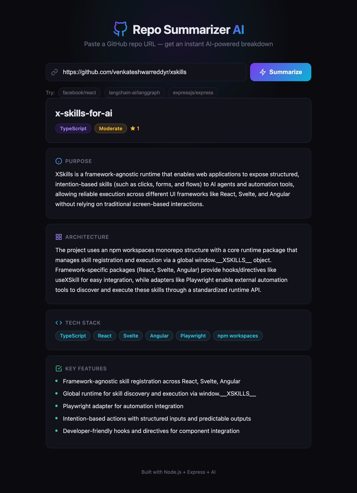

<div align="center">

# Repo Summarizer AI

### Paste a GitHub URL, get an instant AI-powered breakdown of any repository

[](https://nextjs.org/)
[](https://www.typescriptlang.org/)
[](https://tailwindcss.com/)
[](https://platform.openai.com/)

<br />

<!-- screenshot -->


<br />
<br />

[**Live Demo**](https://repo-summarizer-ai.vercel.app) &nbsp;&middot;&nbsp; [**Report Bug**](../../issues) &nbsp;&middot;&nbsp; [**Request Feature**](../../issues)

</div>

---

## About

Repo Summarizer AI is a web app that analyzes any public GitHub repository and generates a structured AI-powered summary. Paste a repo URL and instantly get the project's purpose, architecture overview, tech stack, key features, and complexity rating — no manual reading required.

### Built With

| Layer | Tech |
|-------|------|
| **Framework** | Next.js 16 (App Router) |
| **Language** | TypeScript 5 |
| **Styling** | Tailwind CSS 4 |
| **AI** | OpenAI-compatible API (HuggingFace, OpenAI, or any compatible provider) |
| **Data Source** | GitHub REST API |
| **Deployment** | Vercel / any Node.js host |

---

## Features

<table>
<tr>
<td width="50%">

**Intelligent Analysis**
- AI-generated purpose & architecture summaries
- Automatic tech stack detection
- Complexity rating (simple / moderate / complex)
- Key feature extraction

</td>
<td width="50%">

**Smart Data Fetching**
- Reads README, file tree & config files automatically
- Supports 10+ config formats (package.json, Cargo.toml, go.mod, etc.)
- Parallel fetching for fast results
- Optional GitHub token for higher rate limits

</td>
</tr>
<tr>
<td>

**Flexible LLM Backend**
- Works with any OpenAI-compatible API
- HuggingFace Inference API out of the box
- Configurable model & base URL
- Structured JSON output via response format

</td>
<td>

**Polished UI**
- Dark-themed glassmorphism design
- One-click example repos (React, LangGraph, Express)
- Animated loading states
- Fully responsive on mobile & desktop

</td>
</tr>
</table>

---

## Quick Start

### Prerequisites

- **Node.js** 18+
- **LLM API key** — any OpenAI-compatible provider ([HuggingFace](https://huggingface.co/settings/tokens), [OpenAI](https://platform.openai.com/api-keys), etc.)

### Installation

```bash
# Clone the repo
git clone https://github.com/venkateshwarreddyr/repo-summarizer-ai.git
cd repo-summarizer-ai

# Install dependencies
npm install

# Set up environment
cp .env.example .env.local
```

Add your API key to `.env.local`:

```env
LLM_API_KEY=your-api-key-here
```

### Run

```bash
npm run dev
```

Open **http://localhost:3000** and paste any GitHub repo URL to analyze it.

---

## Project Structure

```
src/
├── app/
│   ├── api/summarize/route.ts      # POST endpoint — orchestrates fetch + LLM
│   ├── globals.css                  # Theme & animations
│   ├── layout.tsx                   # SEO metadata & fonts
│   └── page.tsx                     # Main page composition
├── components/
│   ├── Header.tsx                   # Glassmorphism navbar
│   ├── Hero.tsx                     # Animated hero + "How it Works"
│   ├── RepoAnalyzer.tsx             # URL input + example repos + results
│   ├── ResultCards.tsx              # Structured summary cards
│   ├── LoadingState.tsx             # Animated loading skeleton
│   └── Footer.tsx                   # Site footer
└── lib/
    ├── github.ts                    # GitHub API helpers (README, tree, configs)
    └── llm.ts                       # OpenAI-compatible LLM client
```

---

## API Reference

### `POST /api/summarize`

Analyzes a public GitHub repository and returns a structured summary.

**Request:**

```json
{
  "repoUrl": "https://github.com/facebook/react"
}
```

**Response:**

```json
{
  "name": "react",
  "language": "JavaScript",
  "techStack": ["React", "Rollup", "Jest", "Flow"],
  "purpose": "A declarative, component-based JavaScript library for building user interfaces.",
  "architecture": "Monorepo with separate packages for core reconciler, DOM renderer, and server-side rendering...",
  "keyFeatures": [
    "Virtual DOM with fiber reconciler",
    "Server Components and streaming SSR",
    "Hooks API for state and side effects"
  ],
  "complexity": "complex",
  "stars": 233000,
  "url": "https://github.com/facebook/react"
}
```

**Error Responses:**

| Status | Description |
|--------|-------------|
| `400` | Missing or invalid GitHub URL |
| `404` | Repository not found (may be private) |
| `500` | LLM or server error |

---

## Environment Variables

| Variable | Description | Required | Default |
|----------|-------------|----------|---------|
| `LLM_API_KEY` | API key for your LLM provider | Yes | — |
| `LLM_BASE_URL` | Base URL for OpenAI-compatible API | No | `https://router.huggingface.co/v1` |
| `LLM_MODEL` | Model identifier | No | `zai-org/GLM-5:zai-org` |
| `OPENAI_API_KEY` | Fallback API key (used if `LLM_API_KEY` is not set) | No | — |
| `GITHUB_TOKEN` | GitHub personal access token for higher rate limits | No | — |

---

## Deploy

### Vercel (Recommended)

[](https://vercel.com/new/clone?repository-url=https://github.com/venkateshwarreddyr/repo-summarizer-ai&env=LLM_API_KEY&envDescription=API%20key%20for%20an%20OpenAI-compatible%20LLM%20provider)

### Manual

```bash
npm run build
npm start
```

The production server starts on port 3000 by default.

---

## Contributing

Contributions are welcome! Fork the repo, create a feature branch, and open a PR.

```bash
git checkout -b feature/amazing-feature
git commit -m "Add amazing feature"
git push origin feature/amazing-feature
```

---

## License

Distributed under the MIT License. See `LICENSE` for more information.

---

<div align="center">

**[Repo Summarizer AI](https://repo-summarizer-ai.vercel.app)** &mdash; Built with Next.js, Tailwind CSS & AI

</div>
